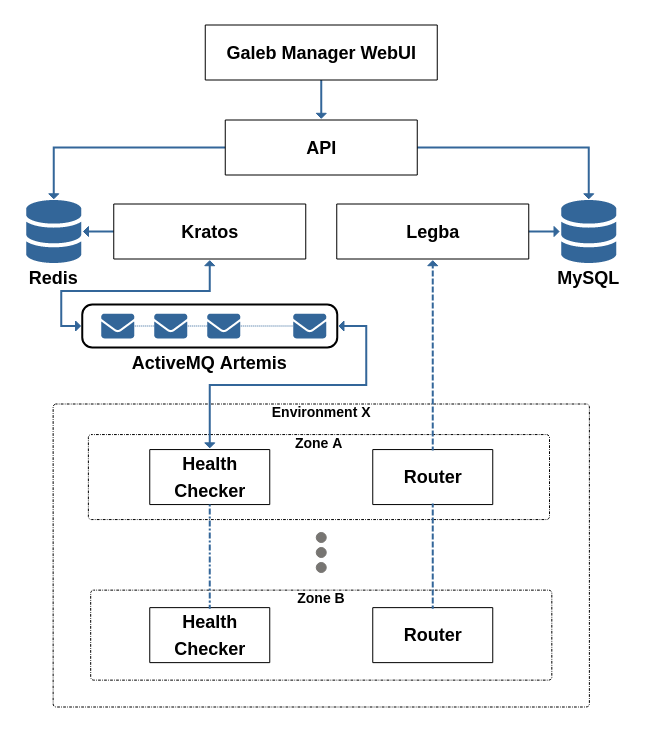

# Galeb v4


[](https://circleci.com/gh/galeb/galeb/tree/master)

## About

Galeb is an open source HTTP load balancing service.

## Galeb Architecture



## Setup

To generate rpm for galeb in the root project directory run:
```
$ export GALEB_VERSION="4.0.000"
$ make dist
```
The artifacts is generated in folder ${PROJECT_DIR}/dists

To install rpm run: 
```
$ yum install galeb-${service}-${GALEB_VERSION}.el7.noarch.rpm
```

## Tests

To run all tests:
```
$ make test-local
```
